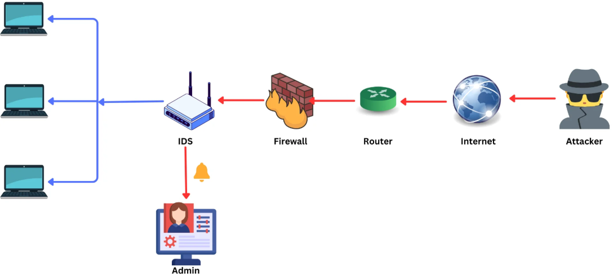
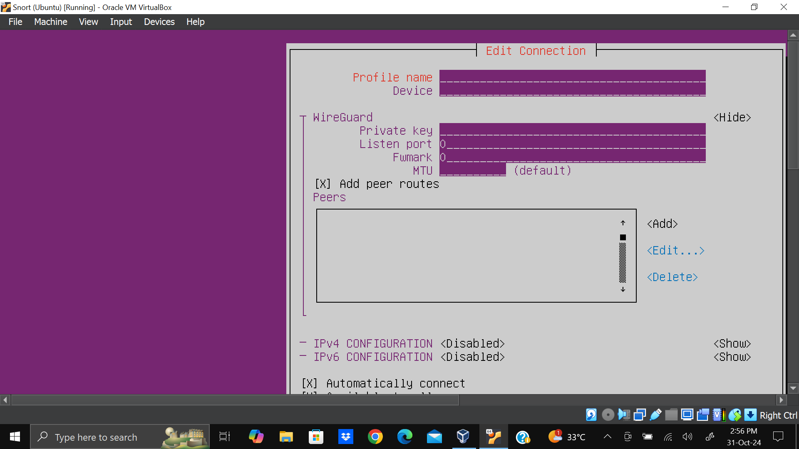

# Real-Time Threat Detection and Mitigation Using Snort IDS

This project demonstrates the use of Snort Intrusion Detection System (IDS) for real-time detection and mitigation of cyber threats based on known vulnerabilities. It focuses on configuring Snort rules, monitoring network traffic, and responding to suspicious activities in a simulated environment.

## 🎯 Objectives
- Deploy and configure Snort IDS for real-time monitoring.  
- Detect and analyze malicious traffic using custom rules.  
- Mitigate detected threats through incident response measures.  
- Evaluate the effectiveness of Snort in protecting network infrastructure.

## 🧩 Project Architecture & Workflow
1. Network traffic is generated within a simulated lab environment.
2. Snort monitors traffic in real time using custom detection rules.
3. Suspicious packets trigger alerts and are logged.
4. Logs are analyzed using Snort output and Wireshark.
5. Identified threats inform mitigation and response actions.

## 🧩 Project Architecture & Workflow

*Figure: High-level architecture showing traffic flow and IDS monitoring.*

1. External traffic originates from an attacker machine.
2. Traffic passes through the internet, router, and firewall.
3. Snort IDS inspects packets in real time.
4. Suspicious activity triggers alerts to the administrator.
5. Legitimate traffic reaches internal hosts.

## ⚡ Key Features
- Packet inspection and rule-based intrusion detection  
- Real-time alerts on suspicious activities  
- Log analysis for forensic investigation  
- Integration with system/network defense measures

## 📊 Outcomes & Results
- Successfully detected simulated attack patterns such as port scans and suspicious payloads.
- Generated real-time alerts with tuned rules to reduce false positives.
- Demonstrated effective incident response through structured log analysis.  

## 🔧 Technologies & Tools
- Snort IDS  
- Wireshark (traffic analysis)  
- Kali Linux / Ubuntu environments  
- Custom Snort rules  

## 📸 Screenshots & Results

### VirtualBox Lab Environment Overview

### Snort Setup & Configuration Screen

### Snort Traffic Analysis Log 1

### Snort Alert Log 2

### Snort Alert Log 3

## 📚 Use Case
This project was developed and successfully defended as a final-year academic project under the supervision of the **Computer Science Department, Petroleum Training Institute (PTI), Nigeria**, demonstrating the deployment of Snort IDS for real-time intrusion detection and network threat mitigation.

## 📄 License
For educational demonstration and academic research.  
