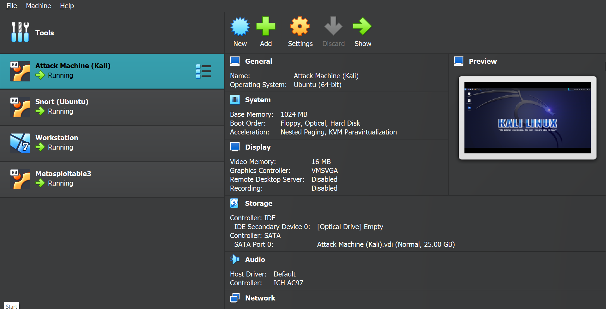
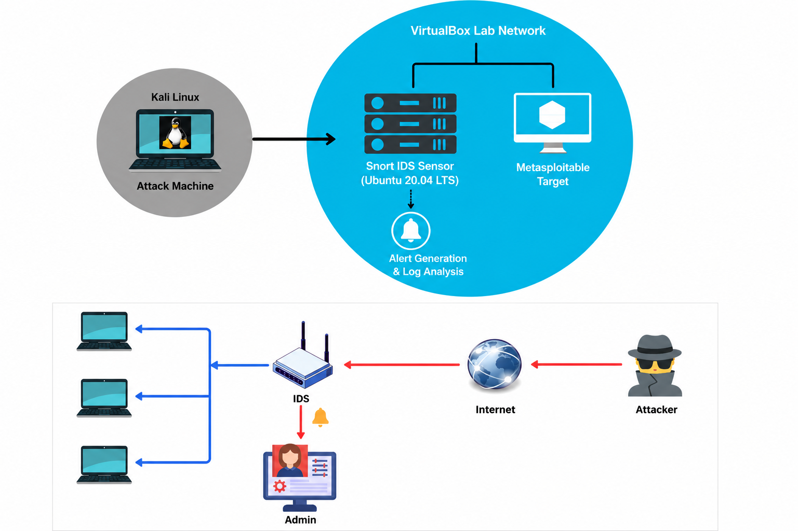
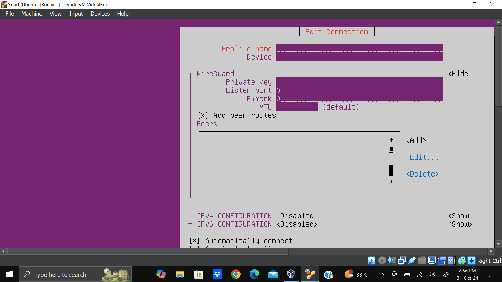
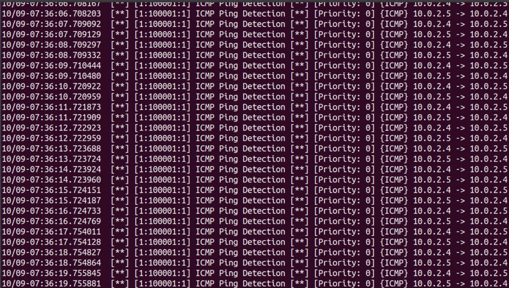
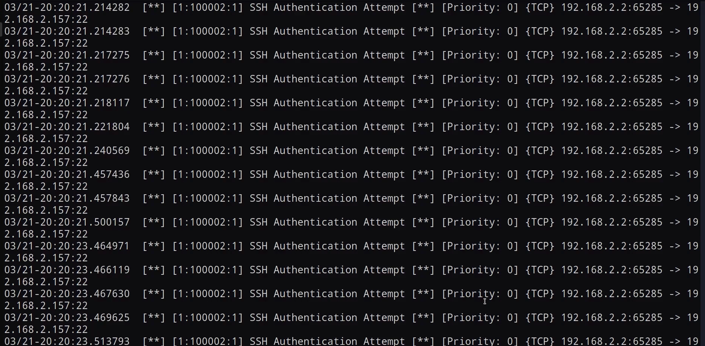
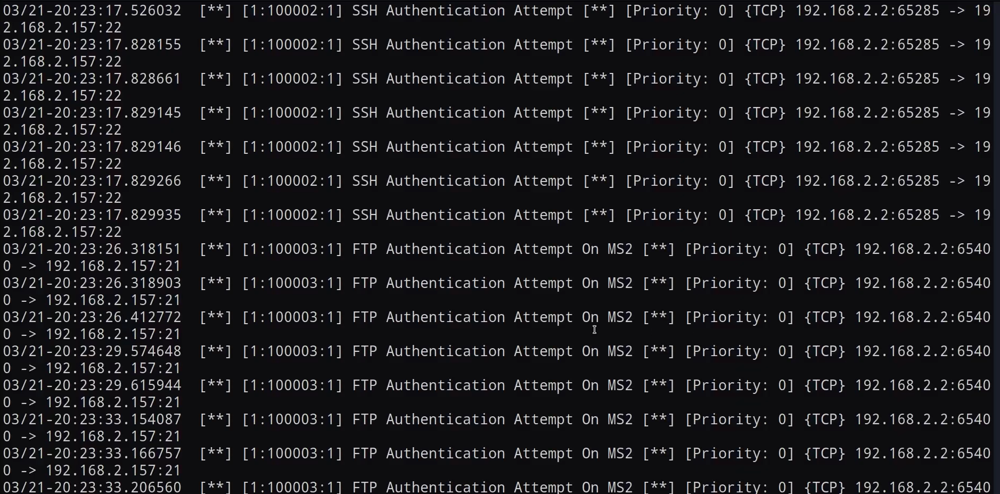

# Snort-Based Intrusion Detection and Threat Monitoring Environment

This repository documents the design, implementation, and validation of a Snort-based intrusion detection environment for real-time threat monitoring, attack detection, and security alerting within a virtualised network.

## 🎯 Security Monitoring Capabilities
- Deploy and configure a Snort IDS sensor for real-time traffic inspection.  
- Develop and tune custom detection rules for malicious traffic identification.
- Generate actionable alerts to support incident detection and response workflows.
- Evaluate the effectiveness of Snort in protecting network infrastructure.

## 🖥️ Deployment Environment

This project was implemented in an isolated virtualised lab environment to safely simulate real-world attack and detection scenarios without impacting production systems.

### VirtualBox Lab Environment Overview

**Hardware**
- Host machine with Intel Core i5 or higher
- Minimum 8GB RAM (16GB recommended)
- Ethernet-capable NIC with packet capture support

**Virtual Machines**
- Snort IDS Machine: Ubuntu 20.04 LTS
- Attack Machine: Kali Linux

**Software & Tools**
- Oracle VM VirtualBox
- Snort IDS (v2.9.20)
- Wireshark
- Metasploit Framework

## 🧩 Detection Architecture

*Figure: High-level architecture showing traffic flow and IDS monitoring.*

1. External traffic originates from an attacker machine.
2. Traffic passes through the internet, router, and firewall.
3. Snort IDS inspects packets in real time.
4. Suspicious activity triggers alerts to the administrator.
5. Legitimate traffic reaches internal hosts.

## ⚙️ Snort Configuration Overview

- Ubuntu 20.04 LTS was installed and configured as the IDS host.
- Snort 2.9.20 was compiled and installed with required dependencies.
- Custom detection rules were created and tuned.
- Snort was configured to generate real-time alerts and structured logs for threat detection and post-incident analysis.

Detailed installation steps are available in

[Snort Installation Guide](docs/snort-installation.md).

## ⚡ Key Features
- Packet inspection and rule-based intrusion detection  
- Real-time alerts on suspicious activities  
- Log analysis for forensic investigation  
- Integration with system/network defense measures

## 📊 Outcomes & Results
- Successfully detected simulated attack patterns such as port scans and suspicious payloads.
- Generated real-time alerts with tuned rules to reduce false positives.
- Validated detection and investigation workflows through structured alert and log analysis.
- The implementation demonstrates intrusion detection, monitoring, and alerting workflows aligned with enterprise security operations.

## 🛡️ Operational Relevance
This implementation reflects practical security monitoring workflows commonly used in Security Operations Centres (SOC), including:
- Network intrusion detection
- Security monitoring and alerting
- Detection engineering and rule tuning
- Threat investigation and log analysis
- Incident response support

## 🔧 Security Stack
- Snort IDS  
- Wireshark (traffic analysis)  
- Kali Linux / Ubuntu environments  
- Custom Snort rules  

## 📸 Implementation Evidence

### Snort Setup & Configuration Screen

### Snort Traffic Analysis Log 1

### Snort Alert Log 2

### Snort Alert Log 3

## 📚 Use Case
This implementation demonstrates the deployment of a Snort-based intrusion detection solution for real-time network monitoring, attack detection, and alert generation within a controlled virtualised environment.

## 📄 License
This repository is provided for cybersecurity learning, security monitoring demonstrations, and reference implementation purposes.
